# AI in Plain English: A Quick Interview Guide

## The one-minute story

AI is not new. Researchers have worked on it for decades. The recent wave happened because several ideas finally worked well together: neural networks learned from large amounts of data, GPUs made the math fast enough, Transformers handled context efficiently, large language models became capable, and chat interfaces made them easy to use.

Each new system solved a practical limitation in the one before it:

`rules -> neural networks -> Transformers -> LLMs -> GenAI/chat -> RAG -> agentic AI`

## Interview questions, in chronological order

### 1. Is AI new?

**No.** AI is a broad field that has existed since the 1950s. Earlier systems used rules, search, statistics, and expert knowledge. They could be useful, but they were often brittle: they struggled with messy language, new situations, and the amount of hand-written logic required.

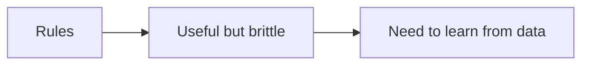

### 2. What problem were AI researchers trying to solve with language?

People wanted computers to understand and produce natural language instead of requiring exact commands. For years, researchers built statistical and neural language models that learned patterns in text. Language is hard because meaning depends on surrounding words, word order, tone, and real-world context.

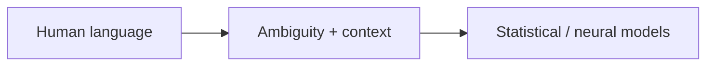

### 3. What is a neural network?

A neural network is a set of connected mathematical layers. During training, it adjusts many numbers called **weights** so it gets better at recognizing patterns. A **deep-learning** model is a neural network with many layers. It does not think like a person; it learns useful mathematical patterns from examples.

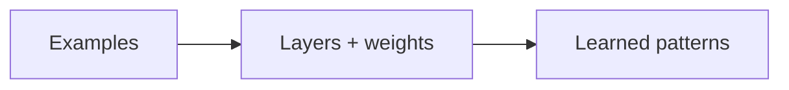

### 4. What is a GPU, and why is it important?

A GPU, or **graphics processing unit**, was originally designed to draw images. It is also very good at doing many similar mathematical operations in parallel. Neural networks use huge matrix calculations, so GPUs and other AI accelerators make training and inference dramatically faster.

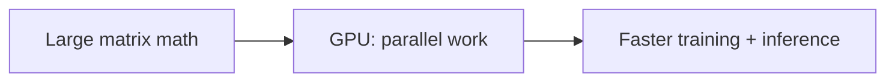

### 5. What changed with “Attention Is All You Need”?

In 2017, that paper introduced the **Transformer** architecture. Its key idea, **attention**, lets a model weigh which parts of the input are most relevant to one another. A useful memory aid is: “context is what you need.” The paper did not use that phrase; its title is “Attention Is All You Need.”

The Transformer was important because it handled context well and could be trained more efficiently in parallel than many earlier recurrent approaches.

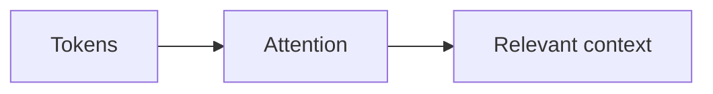

### 6. What is a Transformer?

A Transformer is a neural-network architecture built around attention. It reads tokens and learns relationships between them. Transformers are the foundation for many language models, but a Transformer by itself is not a chatbot or an agent.

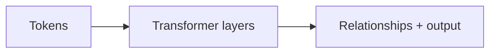

### 7. What is pretraining?

Pretraining is the first large learning stage. A language model sees a huge amount of text and repeatedly practices predicting the next token. It learns grammar, style, facts, and relationships stored as patterns in its weights. This creates a general-purpose base model.

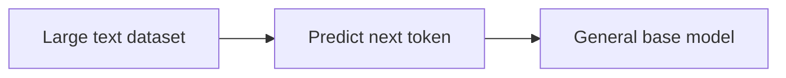

### 8. What is an LLM, and what does GPT mean?

An **LLM** is a **large language model**: a language model with a very large number of learned weights, trained on a large amount of text. The first GPT paper appeared in 2018; later scaling, including GPT-3 in 2020, improved the model’s ability to follow patterns and perform many language tasks.

**GPT** stands for **Generative Pre-trained Transformer**:

- **Generative:** it generates an output, usually one token at a time.
- **Pre-trained:** it first learns general language patterns from large datasets.
- **Transformer:** it uses the Transformer architecture.

GPT is one family of LLMs; not every LLM is a GPT model.

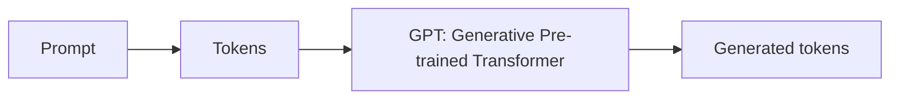

### 9. What is a token?

A token is a small piece of text that a model reads or produces. It can be a whole word, part of a word, punctuation, or a space-plus-word pattern, depending on the tokenizer. The model converts tokens into numbers, processes them, and predicts the next token.

Tokens are not exactly words. Token counts affect context limits, speed, and usage cost. A simple mental model is: **text in -> tokens -> numbers -> model -> tokens out -> text**.

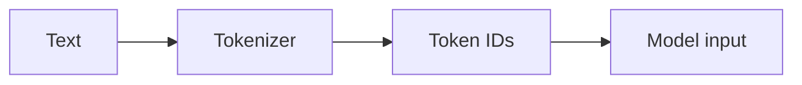

### 10. What is inference?

**Inference** is using a trained model. When you send a prompt, the model processes the input and generates an answer. **Training** changes the model’s weights; **inference** uses those weights to produce an output. ChatGPT answers are inference, not fresh training of the public model on every question.

```mermaid
flowchart LR
    A[Trained weights] + B[Prompt] --> C[Inference]
    C --> D[Answer]
```

### 11. What is GenAI?

**Generative AI**, or GenAI, creates new output from a prompt or other input. An LLM is a GenAI system that generates text or code, but GenAI can also generate images, audio, video, or structured data. GenAI is broader than “generate something in English.”

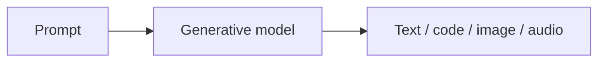

### 12. Why did ChatGPT matter?

In 2022, ChatGPT made large language models easy for everyday people to use through a simple conversation. It was not the first natural-language AI tool or the first way to interact with a GPT-style model. Its major contribution was making instruction-following, multi-turn conversation, and useful generation feel accessible in one product.

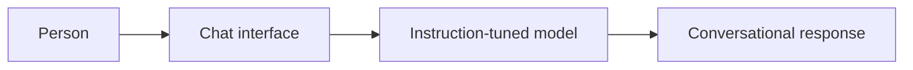

### 13. Why was RAG needed?

An LLM alone has two important limitations:

1. Its training data has a cutoff date, so it may not know recent information.
2. It does not automatically know an organization’s private documents, policies, or current operational data.

The term **RAG**, or **retrieval-augmented generation**, was formalized in a 2020 paper. RAG addresses the problem by retrieving relevant information at question time and placing it in the model’s context. The model then uses that retrieved context to write an answer.

RAG is usually a pipeline:

`question -> search private/current sources -> select passages -> prompt LLM -> grounded answer`

RAG normally does not retrain the model. It gives the model additional context, which can also make answers easier to verify when sources are shown.

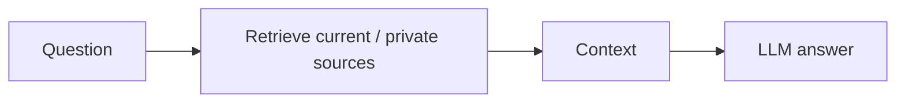

### 14. What are embeddings and a vector database?

An **embedding** is a list of numbers that represents the meaning or features of text. Texts with similar meaning tend to have embeddings that are close together mathematically.

A **vector database** stores embeddings and searches for nearby vectors. In a RAG system, documents are split into passages, converted into embeddings, and indexed. A question is embedded too; the vector search finds relevant passages even when the wording is different.

The vector database is the search memory. The LLM is the language generator. Keeping those roles separate helps explain how private data can be updated without retraining the LLM—but access control, redaction, and source quality are still required.

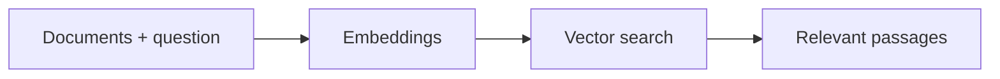

### 15. What is agentic AI?

A normal LLM call usually answers one prompt. An **agentic AI** system can take a goal, break it into steps, use tools, inspect results, remember relevant state, and continue until it reaches a stopping point.

For example, an agent might search a knowledge base, call an API, check the result, and draft a response. Agentic AI is not magic autonomy: reliable systems need permissions, tool boundaries, logging, evaluation, and human approval for risky actions.

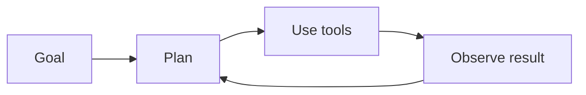

### 16. What important ideas are easy to miss?

Two are especially important:

- **Instruction tuning and alignment:** after pretraining, models are further trained or configured to follow instructions, be helpful, and respect safety rules. This is a major reason a base model can become a usable assistant.
- **Grounding and evaluation:** a fluent answer is not automatically a correct answer. Good systems test accuracy, cite sources where possible, protect private data, and define what the model must do when it is uncertain.

Modern systems also combine text with images, audio, video, code, and tools. This is often called **multimodal AI**.

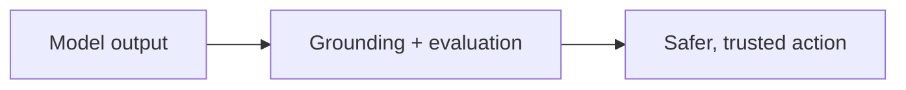

## How to read the diagrams

- **Neural networks** learn numerical patterns from examples instead of depending only on hand-written rules.
- **GPUs** are a speed enabler. They are not an AI model; they accelerate the large parallel calculations used by training and inference.
- **Transformers** use attention to decide which tokens and pieces of context matter most to one another.
- **LLMs** are large language models. GPT is one LLM family: Generative Pre-trained Transformer.
- **GenAI** creates new output. ChatGPT made conversational use of an LLM accessible to a broad audience; it was not the first natural-language AI tool.
- **RAG** retrieves information at question time and supplies it to the LLM. It normally does not retrain the model.
- **A vector database** stores embeddings so a system can find passages with similar meaning.
- **Agentic AI** adds a controlled loop around a model so it can complete a goal using tools and multiple steps.

## One-line mental model

```text
LLM = generates language
RAG = supplies better context
Agent = uses the model in a tool-using loop
```

## The simplest mental model

An LLM is a powerful pattern generator. It predicts likely next tokens from the context it receives. RAG supplies better, more current context. An agent adds a loop around the model so it can use tools and complete multi-step work. None of these removes the need for good data, security, testing, or human judgment.

## Selected sources

- [Attention Is All You Need](https://arxiv.org/abs/1706.03762) — the 2017 Transformer paper.
- [Retrieval-Augmented Generation for Knowledge-Intensive NLP Tasks](https://arxiv.org/abs/2005.11401) — the 2020 RAG paper.
- [Language Models are Few-Shot Learners](https://arxiv.org/abs/2005.14165) — the GPT-3 paper.
- [Introducing ChatGPT](https://openai.com/index/chatgpt/) — OpenAI’s product introduction.
